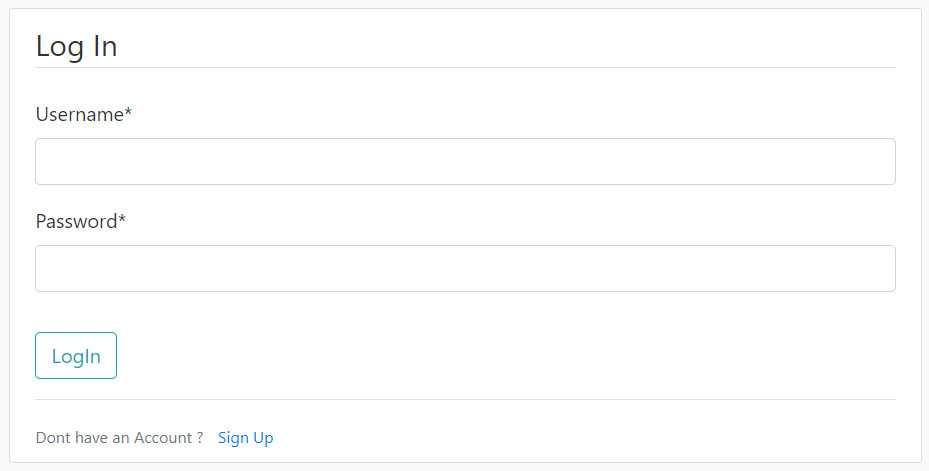
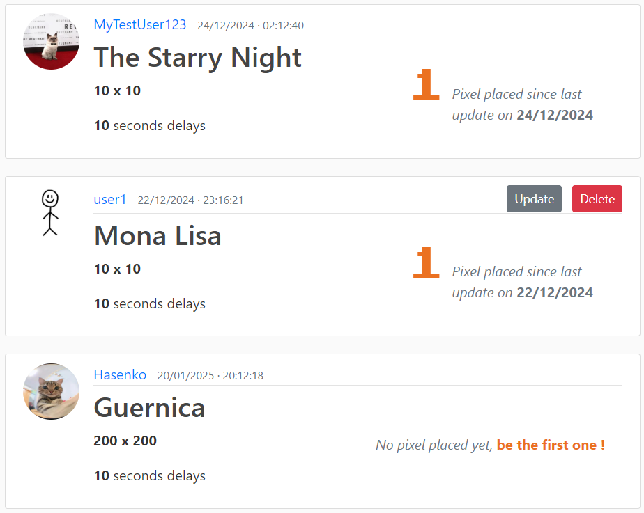
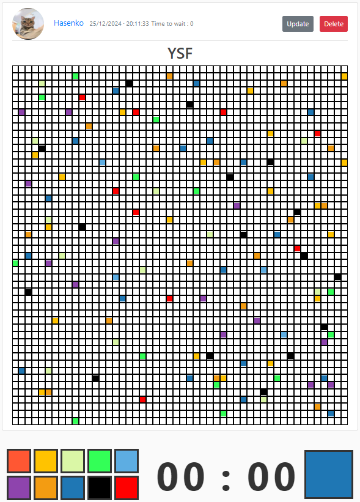
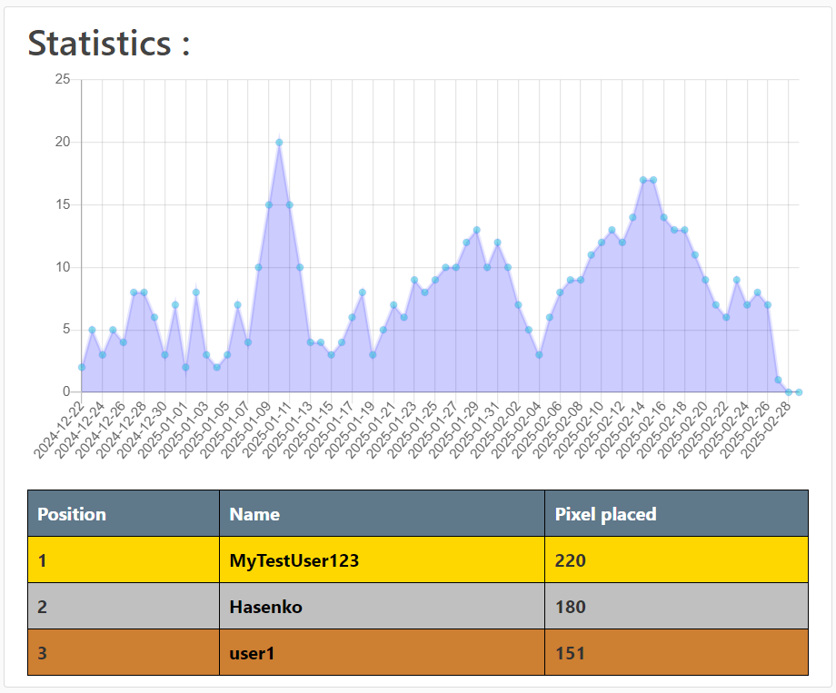

# HELBPlace - Web Project II - 2024-2025

> **El Bouchtili Imaddine | February 27th, 2025**

--------------------------

## Introduction
HELBPlace is a website allowing interaction with collaborative canvases. This website can be compared to the famous collaborative project [r/place](https://www.reddit.com/r/place/), organised by the [Reddit forum](https://www.reddit.com). The project was developed using the Django framework and a functional base presented by [Corey Schafer](https://github.com/CoreyMSchafer). This website was carried out as part of the Web II programming course. This course is part of the second-year Bachelor's degree in Computer Science : Application Development at the Haute École Libre de Bruxelles.

The project guidelines can be found here : [HELBPlace Statements.pdf](<HELBPlace Statements.pdf>) (FR).

## Technologies
A number of tools were used to design the website. These tools enable a smoother development and user experience.

### Corey Schafer's basis
The website was developed from a tutorial created by Corey Schafer. By following a [playlist](https://youtube.com/playlist?list=PL-osiE80TeTtoQCKZ03TU5fNfx2UY6U4p&si=T2q9zGfQ4w-R8zhP) of videos designed by Corey Schafer, I had a fairly solid base of knowledge about Django, as well as a working code base. This base remained until the end of the project.

### Django
I chose to use the Django framework because it provides a pre-configured server with many advanced features. In addition, Django integrates a database management system, which was essential for this project.

The framework is based on MVT (Model-View- Template) architecture, a variant of MVC architecture, which allows code to be better organised and avoids duplication. A particularly useful feature is the ability to convert Python classes directly into database tables, which has greatly simplified development.

Django is also very useful for managing different views. Its template system makes it easy to model views. The ability to inherit between templates and to use programming elements directly in views, such as conditions, has also helped a lot.

Forms management was another feature offered by Django that I used a lot, particularly thanks to its `crispy forms` library. This library lets you create forms from a model and customise the fields.

### Bootstrap
Bootstrap is a web development library that provides a number of CSS classes useful for creating a website. In this project, Bootstrap was present in the base provided by Corey Schafer, which is why I used it on a small scale.

### JQuery & AJAX
JQuery is a JavaScript library that greatly simplifies certain complex functionalities, in particular AJAX.

AJAX has been used to enable asynchronous requests to be sent to the server. As a result, certain pages of the website can be updated without refreshing the page, although this should not be abused. This has mainly been used to automatically refresh collaborative canvases.

### Chart.js
Chart.js is a JavaScript library that lets you create and display charts on web pages. In particular, it has been used to monitor the statistics of the webs using a graph showing the number of contributions per day.

This technology is very easy to learn, thanks to its simplicity and the comprehensive tutorials on the [W3Schools](https://www.w3schools.com) site.

## Features
HELBPlace is a collaborative web platform inspired by r/place, enabling users to modify collaborative canvases pixel by pixel.

### Registration and Login
A registration system has been set up to differentiate between the various users, enable statistical monitoring and allow interaction with the canvases. This system is directly integrated into Django. The default registration form wasn't very organised, so I modified it a little using the `crispy forms` library.

### Creating / Managing canvases
To create a collaborative canvas, users must be logged in to their account. They also need to specify the dimensions of the canvas and the waiting time between each pixel placed by the participants.

Once the canvas has been created, it appears on the home page of the website, where the canvases are sorted according to their activity. This sorting takes into account two parameters : the date of the last modification made to the canvas and the number of pixels modified on that date. New canvases are displayed at the bottom of the list.

Once a canvas has been created, its creators can modify certain information, such as the name of the canvas or the waiting time between each pixel placed. They can also delete their canvas if they wish.

### Interactions with canvases
To interact with a canvas, you need to be logged in to an account and click on the title of the canvas from the home page.

Once redirected to the canvas page, it is displayed in the form of a grid. To change the colour of a pixel, the user must first select a colour from the tools bar. A timer is also displayed to indicate the time remaining before the user can place a new pixel.

Canvases are updated automatically every second. This makes for a smoother user experience, as there is no need to refresh the page each time a change is made.

In addition to interacting with the collaborative canvases created on the website, HELBPlace offers the possibility of interacting with a helbplace2425 canvas, present on another server at the address https://helbplace2425.alwaysdata.net. In the same way as with traditional canvases, a user can select a pixel and change its colour intuitively.

### Tracking statistics on canvases
To enable statistical monitoring of collaborative canvases, several pieces of information are collected each time a pixel is modified :
- Date of modification
- User who modified the pixel

A graph is created to show the number of pixels modified each day since the canvas was created. A table also shows the number of pixels modified by each user. These two elements are displayed in a section dedicated to canvas statistics.

In addition, a user's profile lists all the canvases in which they have participated. These are sorted according to the number of pixels modified by the user on each canvas.
